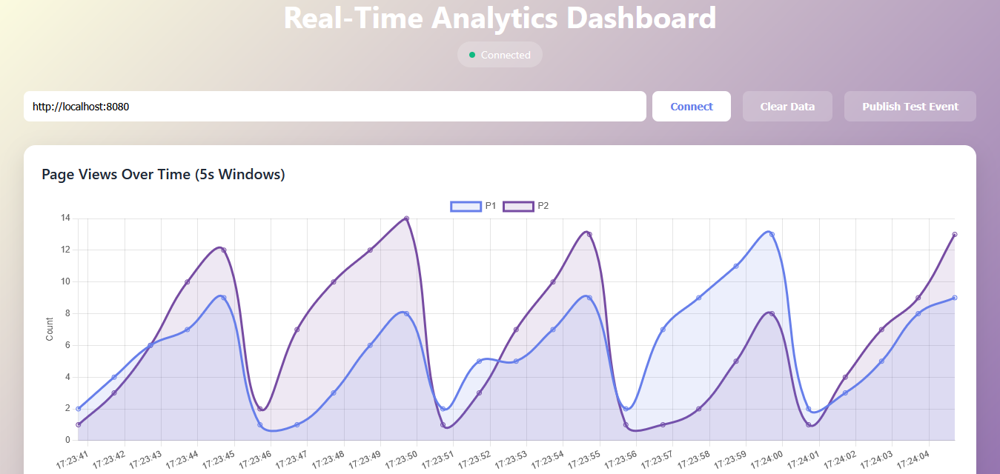

# Data Analytics avec Apache Kafka et Spring Cloud Stream

Une application de traitement analytique en temps réel utilisant Apache Kafka, Spring Cloud Stream, et Kafka Streams pour analyser les événements de pages web.



## 🚀 Fonctionnalités

- Traitement en temps réel des événements de pages
- Dashboard analytique interactif avec Chart.js
- Analyse des événements avec fenêtres temporelles de 5 secondes
- Interface utilisateur réactive avec mises à jour en temps réel
- Architecture basée sur les microservices avec Kafka

## 🏗 Architecture

### Components Principaux

#### 1. Controller (`PageEventController`)
- Gère les endpoints REST pour la publication d'événements
- Fournit des analytics en temps réel via Server-Sent Events (SSE)
- Endpoints:
  - `GET /publish`: Publie un événement de page
  - `GET /analytics`: Flux SSE pour les analytics en temps réel

#### 2. Event Handler (`PageEventHandler`)
- Implémente la logique de traitement des événements
- Comprend:
  - Consumer: Traite les événements entrants
  - Supplier: Génère des événements de test
  - KStream: Agrège les données sur des fenêtres de 5 secondes

#### 3. Model (`PageEvent`)
- Record Java représentant un événement de page
- Attributs:
  - `name`: Nom de la page
  - `user`: Identifiant utilisateur
  - `date`: Horodatage
  - `duration`: Durée de la visite

## 🛠 Configuration Docker

```yaml
version: '3'
services:
  zookeeper:
    image: wurstmeister/zookeeper:latest
    ports:
      - "2181:2181"
    environment:
      ZOOKEEPER_CLIENT_PORT: 2181
      ZOOKEEPER_TICK_TIME: 2000

  broker:
    image: wurstmeister/kafka:latest
    ports:
      - "9092:9092"
    environment:
      KAFKA_BROKER_ID: 1
      KAFKA_ZOOKEEPER_CONNECT: 'zookeeper:2181'
      KAFKA_ADVERTISED_LISTENERS: PLAINTEXT://localhost:9092,PLAINTEXT_INTERNAL://broker:29092
      KAFKA_LISTENERS: PLAINTEXT://0.0.0.0:9092,PLAINTEXT_INTERNAL://0.0.0.0:29092
      KAFKA_LISTENER_SECURITY_PROTOCOL_MAP: PLAINTEXT:PLAINTEXT,PLAINTEXT_INTERNAL:PLAINTEXT
      KAFKA_OFFSETS_TOPIC_REPLICATION_FACTOR: 1
```

## 📝 Configuration Spring

```properties
spring.application.name=data-analytics-kafka
server.port=8080
spring.cloud.stream.bindings.pageEventConsumer-in-0.destination=T1
spring.cloud.stream.bindings.pageEventSupplier-out-0.destination=T6
spring.cloud.stream.bindings.kStream-in-0.destination=T6
spring.cloud.stream.bindings.kStream-out-0.destination=T7
```

## 🚦 Démarrage

1. Lancer l'infrastructure Kafka:
```bash
docker-compose up -d
```

2. Démarrer l'application Spring Boot:
```bash
./mvnw spring-boot:run
```

3. Accéder au dashboard:
```
http://localhost:8080
```

## 📊 Interface Utilisateur

Le dashboard fournit:
- Graphique en temps réel des vues de pages
- Statistiques actuelles par page
- Journal d'activité en direct
- Contrôles pour:
  - Connexion au serveur
  - Publication d'événements de test
  - Effacement des données

## 🔧 Technologies Utilisées

- **Backend**:
  - Spring Boot
  - Spring Cloud Stream
  - Apache Kafka
  - Kafka Streams
  
- **Frontend**:
  - HTML5
  - CSS3
  - Chart.js
  - Server-Sent Events

## 📈 Performance

- Traitement en temps réel avec latence minimale
- Fenêtres glissantes de 5 secondes pour les agrégations
- Mise à l'échelle horizontale possible avec Kafka

## 🤝 Contribution

Les contributions sont les bienvenues ! N'hésitez pas à:
1. Fork le projet
2. Créer une branche (`git checkout -b feature/AmazingFeature`)
3. Commit vos changements (`git commit -m 'Add some AmazingFeature'`)
4. Push sur la branche (`git push origin feature/AmazingFeature`)
5. Ouvrir une Pull Request
